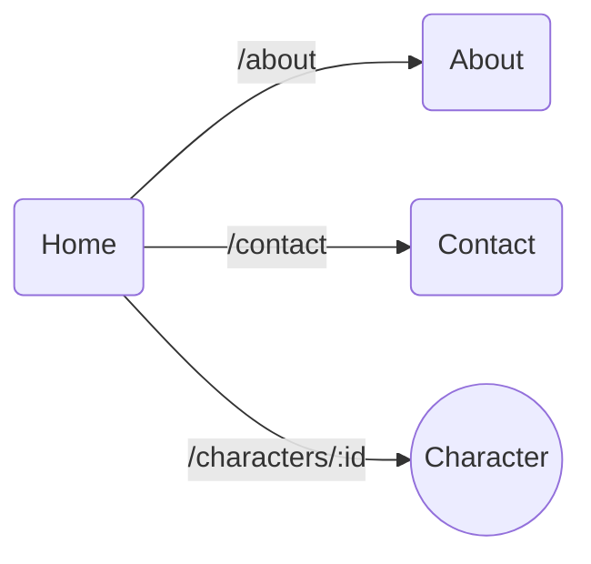

[](https://github.com/alex1dregirard/marvel-app-2023/actions/workflows/unit-tests.yml)

[](https://sonarcloud.io/summary/new_code?id=alex1dregirard_marvel-app-2023)
[](https://sonarcloud.io/summary/new_code?id=alex1dregirard_marvel-app-2023)

# Marvel App

## Installation

Récupérer le projet en local et installer les dépendances

```bash
git clone url-du-projet
cd marvel-app
npm install
```

## Lancement

```bash
npm start
```

L'application est accessible à l'adresse http://localhost:3000

## Test

Execution des tests unitaires en mode watch, c'est à dire que les tests sont relancés à chaque modification de code.

```bash
npm test
```

Execution des tests uniquement une fois avec un rapport détaillé de la couverture de code

```bash
npm run test:coverage
```

## Conception

Le projet est composé de 4 pages :

- Home (page d'accueil): Liste des personnages
- Character: Page de détail d'un personnage
- About: Page d'information sur l'application
- Contact: Page de contact


